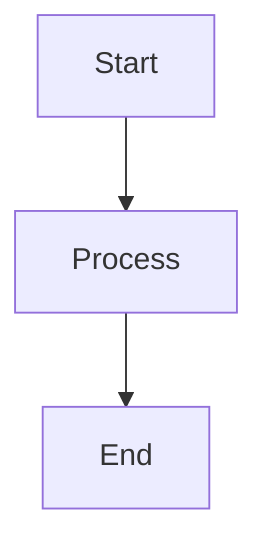

# Example Page

This page demonstrates the various features of MDNet.

## Wiki Links

You can navigate back to the [[index|home page]] or check out the [[features]] page.

Links can be created with just the page name: [[index]]

Or with custom text: [[index|Go to Home]]

## Example of tags
#tag1 #tag2 #tag3

## Custom Plugin Blocks

MDNet supports custom plugin blocks. These are code blocks with special plugin identifiers:



```dataview
TABLE file.name, file.mtime
FROM "content"
```

```custom
This is a custom plugin block.
It will be wrapped in a special container
with data-plugin="custom" attribute.
```

## Standard Code Blocks

Regular code blocks work too:

```javascript
function hello() {
  console.log('Hello, World!');
}
```

```python
def greet(name):
    print(f"Hello, {name}!")
```

## Navigation

- [[index]] - Home page
- [[features]] - Features overview
